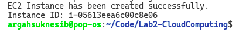
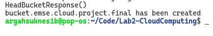
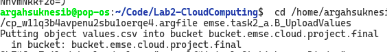
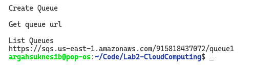
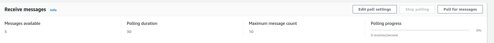
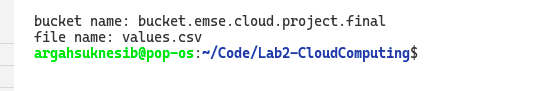
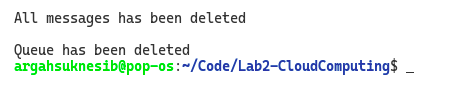
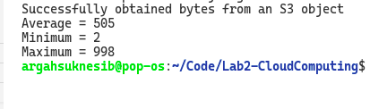
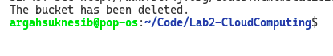

**Lab 2 - Cloud Computing**

| Name                 | Diploma |
|----------------------|---------|
| Milad ZAHEDIYAMI     | M2 CPS2 |
| Kushagra Singh BISEN | M2 CPS2 |

*Instructions*

1. src/emse package contains all the code related to the project.
2. emse package is divided into subpackages in accordance with the tasks given.
3. Each class is runnable seperately by manually passing the argument needed to run the class.

        -> as task1_a
        -> as task1_b
        -> as task2_a
        -> as task2_b

# RESULTS :

Task 1A :

Mnual Initialization:
defining ec2, name and amId accordingly.

Result:

Task 1B :

Mnual Initialization:
defining ec2, name and amId accordingly.

Result:

    
Task 2A - A :

Mnual Initialization:
defining s3, bucketName accordingly.

Result:

Task 2A - B : 

Mnual Initialization:
defining s3, bucketName, objectKey, objectPath accordingly.

Result:

Task 2A - C :

Mnual Initialization:
defining sqsClient, queueName  accordingly.

Result:

Task 2A - D : 

Mnual Initialization:
defining sqsClient, queueName, message accordingly.

Result:

Task 2B - A:

Mnual Initialization:
defining Url, sqsClient accordingly.

Result:

Task 2B - B : 

Mnual Initialization:
defining sqsClient, Url, messages accordingly.

Result:

Task 2B - C &  D : 

Mnual Initialization:
defining s3,bucketName,keyName, path accordingly.

Result:

Task 2B - E:

Mnual Initialization:
defining s3,bucket accordingly.

Result:

